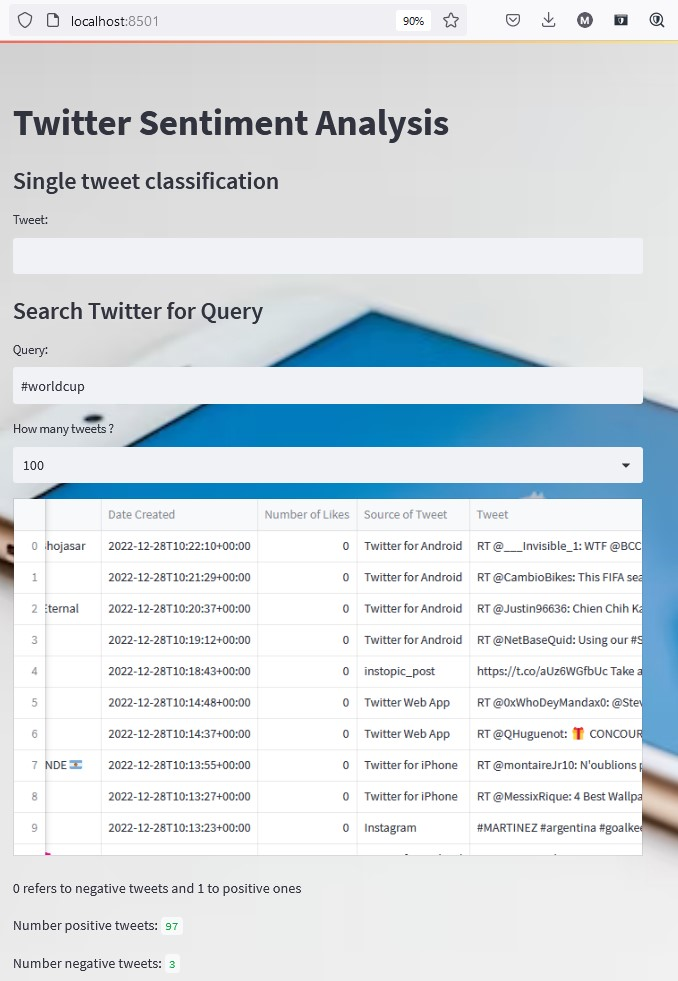

# Twitter Sentiment Analysis

Project carried out as part of the course of Cloud Computing 2022.
Contributors: Hugo Favre, Loris Bulliard, Michel Daher Mansour, Alice Fabre-Verdure

(reading time ~ 5 mins)
## Summary

Architecture of our applicaiton's files.
0. Context
1. Application : Streamlit_app
2. Model
3. Requirements
4. Test 
5. Image and container: Dockerfile and command
   - BONUS: Dockerhub
6. Example
7. Outlook

## Architecture
```
TWEET ANALYSIS/
│
├── _pycache_
├── .pytest_cache
├── .vscode/
├── .gitattributes
│
├── images/
│   ├── screenshot1.jpg
│   └── screenshot2.jpg
|
├── model-saves/
│   ├── best-model.pt
│   ├── dev.tsv
│   ├── loss.tsv
│   ├── traning.log
│   ├── weights.txt
│   └── final-model.py
│
├── Dockerfile
│
├── modele.py
├── streamlit_app.py
├── test_streamlit_app.py
│
├── requirements.txt
└── README.md
```

### 0. Context

In this project, we wanted to create an application that scrap tweets of a particular hashtag and reveal the
sentiments deriving from these hashtags.
It is a Natural Language Processing (NLP) Problem where Sentiment Analysis is done by Classifying positive and negative tweets by machine learning models for classification, text mining, text analysis and data analysis.

To fulfill our goals, we used streamlit to create an interface to show the sentiments of the tweet (more details 
are provided in section 1).
The prediction of the hashtags/tweet's sentiments is made by training a model (the model is described in the modele.py file, see section 2). We dockerized our application by implementing several steps (check sections 3 and 5).

In this file, we describe in details the steps that should be made for a perfect functioning of this application.

### 1. The application

To create the application we need to install/import the following libraries:
- datetime
- pandas
- streamlit
- flair (falir.models and flair.data)
- tweepy

To define the title, background, subheadder, caption and other characteristics please check the streamlit_app.py file.

For the model we used the 'TextClassifier' model from flair library (check section 2 for details on the model).
For the preprocessing of the hashtags/tweets we created a function and to load the models we used the function from the streamlit library (check file streamit_app.py for more details on the code).

After this procedure, we show the predictions on the interface by labeling the tweet as positive or negative sentiment.
(check section 6, the example for an illustration of the application)

### 2. The model

In this application, we implemented a model that can predict the sentiment (positive or negative) of a hashtag/tweet and provide its confidence level. 

In this application, we implemented a model that can predict the sentiment (positive or negative) of a hashtag/tweet and provide its confidence level. 

In this application we build our model by implementing the different steps (labeling of the text, embedding the words and text classifying) and finally we trained our model to use it in the app. To do that we used the flair library (check details of the code in the file modele.py).

You can find more details on the NLP flair library on this link:
https://github.com/flairNLP/flair

### 3. The requirements

In order to run our model, we need several dependencies (streamlit, flair, tweepy ...).

Therefore, we created 'requirements.txt' file. This file contains the libraries with their specific version for this application to run properly.

### 4. The test using pytest

To assure that our model is functioning with no errors and good performance, we made unit tests and created a file 'test_streamlit_app.py'.

we lunch the test by the command:

```
pytest
```

### 5. The image and container

To dockerize the app, we need to create a docker file (assuming that you already have docker desktop).

Thus, we create a file 'Dockerfile' (Dockerfile is a text document that contains all the commands needed to assemble an image).
Docker builds images automatically by reading the instructions from this Dockerfile.

In our case, we used python:3.10.8 as base image (it is crucial that you update python and work with python3.10 version so the flair's library work porperly).
In the docker file, we create the work directory '/app' and copy the files in it. Moreover, we install the requirements and execute the code with the entrypoint.

 - On local docker (without dockerhub), follow the description below:
```
docker build -t docker_tweet_analysis .
```

Then after building the container to run it:
```
docker run -d -p 8501:8501 docker_tweet_analysis
```

### BONUS: we put our container on dockerhub
follow the link: https://hub.docker.com/repository/docker/alicefabreverdure/tweet_analysis

To pull the repository in vscode: 
```
docker pull alicefabreverdure/tweet_analysis
```
Then we create the image by running it as follows:
```
docker run -d -p 8501:8501 alicefabreverdure/tweet_analysis
```
This version of docker hub will show the background of the application but an error will appear. The origin of this error is the large size of the model. The model is too heavy to be downloaded in docker hub. In local docker, git lfs is sufficient to overcome this problem, whereas docker hub doesn't support this form of git. A second way to solve this problem is by using a google drive link but unfortunately it didn't work also.

This version of docker hub will show the background of the application but an error will appear. The origin of this error is the large size of the modele. The model is too heavy to be normaly pushed in git hub. Then we used git push lfs. Then in local docker, git lfs is sufficient to overcome this problem, whereas docker hub doesn't support this form of git. Indeed : "Currently Docker Hub does not support Git LFS (Large File Storage). If you have binaries in your build context that are managed by Git LFS, only the pointer file is present in the clone made during the automated build, which is not what you want. "

After a long time of research we noticed that it is a probleme for a lot of people and even professional teams. Suggestions to support the git lfs version was made to docker hub. This problem was first confronted in 2015 and persist till now (for more information about this problem, check this tow links: https://stackoverflow.com/questions/73944739/spring-boot-java-jar-file-corrupt-in-docker-image-via-docker-hub-since-using
and  https://github.com/docker/hub-feedback/issues/500).  

A second way to solve this problem is by using a google drive link but, unfortunately, that didn't work either. We created a file download.py which specifies from where to downlod the file and where to download it. The later is located in a public repo, with the right to edit it. However an issue relatives to access appears. Once more, this issue seems to be commom to several persons with no solution.

As it doesn't work as expected, we haven't merged the branch docker-hub. Then on the main branch, to see the final application you have to use docker desktop and the command mentionned in section 5. In order to see the work done relatively to dockerhub, you have to select the branch docker-hub.

### 6. Example

This photo is an illustration of the application that we created. In a first step, the application will scrap the hashtag #worldcup on twitter and return with the last 100 tweets concerning this hashtag. In a second step, the application will label each tweet by positive or negative sentiment.
Finally, it provides a table including information about the tweet(user, date, text...) and its sentiment with the confidence. 



### 7. Outlook

We show in this graph a perspective of this application, where we can visualize in function of time the sentiments of tweet around a specific topic. We can also calculate the ratios of positive or negative tweets per day or week and follow it with time.


This application can help brands to track the tweets concerning its products and reveal the sentiments of its owners, the impact of its product and how to control its marketing campaign.