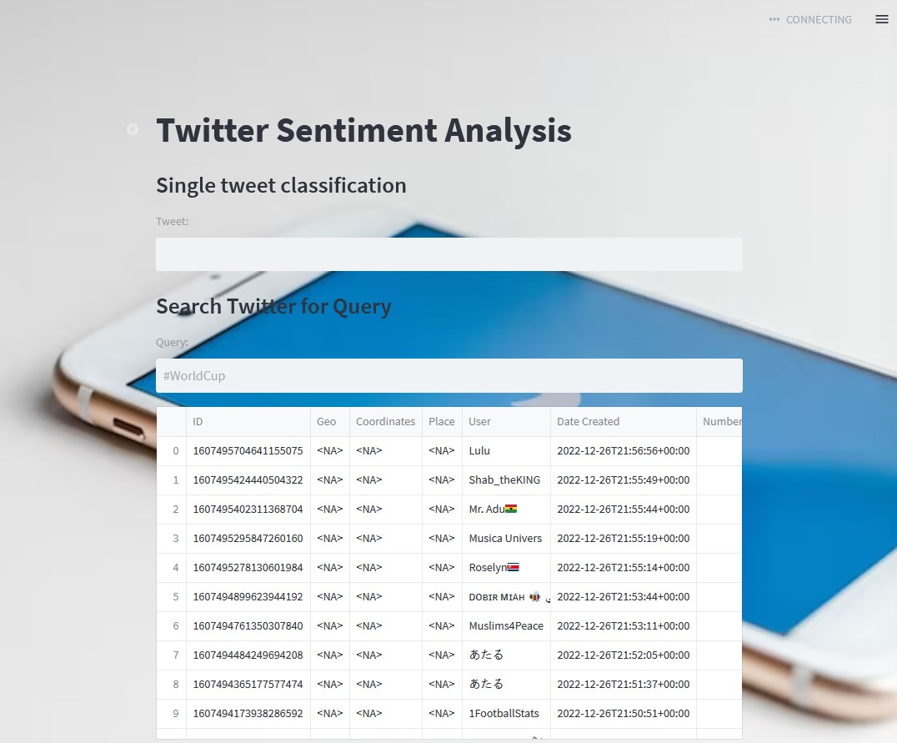

# Twitter Sentiment Analysis

Project carried out as part of the course of Cloud Computing 2022.

## Summary

0. Context
1. Application : Streamlit_app
2. Model: modele.py
3. Requirements
4. Test using pytest
5. Image and container: Dockerfile and command
    - BONUS: Dockerhub
6. Example

## Architecture

TWEET ANALYSIS/
│
├── .vscode/
├── .gitattributes
│
├── model-saves/
│   ├── best-model.pt
│   ├── dev.tsv
│   ├── loss.tsv
│   ├── traning.log
│   ├── weights.txt
│   └── final-model.py
│
├── Dockerfile
│
├── modele.py
├── streamlit_app.py
├── test_streamlit_app.py
│
├── requirements.txt
└── README.md

### 0. Context

    In this project, we wanted to create an application that scrap tweets of a particular hashtag and reveal the
sentiments deriving from these hashtags.
It is a Natural Language Processing(NLP) Problem where Sentiment Analysis is done by Classifying positive and negative tweets by machine learning models for classification, text mining, text analysis and data analysis.

    To fulfill our goals, we used streamlit to create an interface to show the sentiments of the tweet.(More details 
are provided in section 1) 
The prediction of the hashtags/tweet's sentiments is made by training a model (the model is described in the modele.py file, see section 2).We dockerized our application by implementing several steps (check sections 3 and 5) 

In this file, we describe in details the steps that should be made for a perfect functioning of this application.

### 1. The application

To create the application we need to install/import the following libraries:
- datetime
- pandas
- streamlit
- flair (falir.models and flair.data)
- tweepy

To define the title, background, subheadder, caption and other characteristics please check the streamlit_app.py file.

For the model we used the 'TextClassifier' model from flair library(check section 2 for details on the model).
For the preprocessing of the hashtags/tweets we created a function and to load the models we used the function from the streamlit library. (Check file streamit_app.py for more details on the code)

After this procedure,we show the predictions on the interface by labeling the tweet as positive or negative sentiment.

### 2. the model

In this application, we implemented a model that can predict the sentiment(positive or negative) of a hashtag/tweet and provide its confidence level. 

In this application we build our model by implementing the different steps (labeling of the text, embedding the words and text classifying) and finally we trained our model to use it in the app. To do that we used the flair library. (Check details of the code in the file modele.py)

You can find more details on the NLP flair library on this link:
https://github.com/flairNLP/flair

### 3. the requirements

In order to run our model, we need several dependencies.(streamlit, flair, tweepy ...)

Therefore, we created 'requirements.txt' file. this file contains the libraries with their specific version for this application to run.

To install these dependencies, run the following code: 

```
pip install -r requirements.txt
```

### 4. The test using pytest

To assure that our model is functioning with no errors and good performance, we created a file 'test_streamlit_app.py'

we lunch the test by the command:

```
pytest
```
### 5. The image and container

To dockerize the app, we need to create a docker file. (assuming that you already have docker desktop)

Thus, we create a file 'Dockerfile'.(Dockerfile is a text document that contains all the commands needed to assemble an image).
Docker build images automatically by reading the instructions from this Dockerfile.

In our case, we used python:3.10.8 as base image. (It is crucial that you update python and work with python3.10 version so the flair's library work porperly)
We create the work directory '/app' and copy the files in it. Moreover, we install the requirements and execute the code with the entrypoint.

 - On local docker (without dockerhub), follow the description below:
```
docker build -t docker_tweet_analysis .
```

Then after building the container to run it:
```
docker run -d -p 8501:8501 docker_tweet_analysis
```

### BONUS: we put our container on dockerhub
follow the link: https://hub.docker.com/repository/docker/alicefabreverdure/tweet_analysis

To pull the repository in vscode: 
```
docker pull alicefabreverdure/tweet_analysis
```
Then we create the image by running it as follows:
```
docker run -d -p 8501:8501 alicefabreverdure/tweet_analysis
```
This version of docker hub will show the background of the application but an error will appear. The origin of this error is the large size of the modele. The model is too heavy to be downloaded in docker hub. In local docker, git push lfs is sufficient to overcome this problem, whereas docker hub doesn't support this form of push. A second way to solve this problem is by using a google drive link but unfortunately it didn't work also.  

### 6. Example

